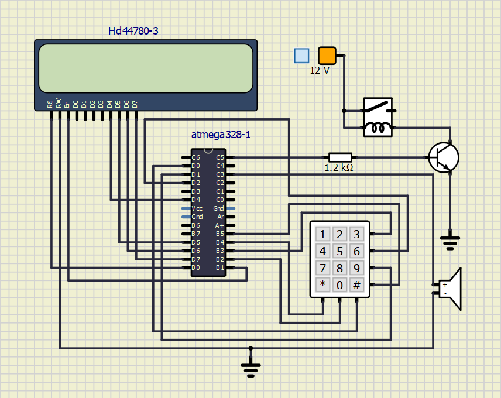
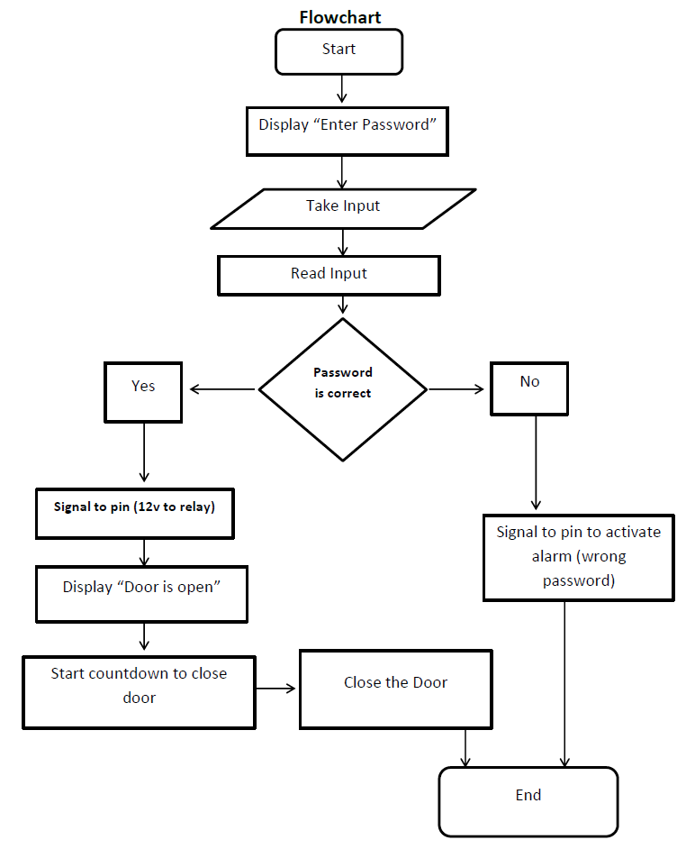

### Participants in the project: [Kreshnik Shala](https://github.com/ShalaKreshnik) and [Nadir Osman Al-Wattar](https://github.com/Nadir011995)
----------------------------------------------------------------------------------------------------------------------------------------------------------------------------
# Project: Smart Door Locking System
### Project objectives

Unlike the traditional door lock system, keypad door locks do not have any need for physical keys. They are basically keyless, that is, anyone can lock or unlock them even without keys. Technically, they work like the ATMs (automated teller machine). People only need to punch in their secret combination numbers in order to lock or unlock their doors. With this kind of entry system, people no longer have to worry about lost or stolen keys and they never have to bring keys with them everywhere they go or hide them in secret places to keep them away from the hands of unauthorized individuals. 
The secret numbers of the keypad door locks can be easily changed into another combination. When people feel that their current number combinations have been divulged to unauthorized individuals, they can always change the codes anytime. In addition, if the current owners of the house decide to sell the property or have the house rented to others, they can always just let the new people living there know about the access codes to the locks. There is no need to change locks at all. 
The aim of this project therefore is to design and construct a keypad/password based electronic door access key that will be able to:

* Eliminate the use of mechanical/metallic keys.
* Prevent events of key misplacements.
* Avoid excessive key duplication for everyone in the house.
* Make the apartment where it is installed more difficult to break into.

In order for this application of the door lock system to work, we need: 
4x3 keyboard; display; door unlock relay; own library for keypad scanning; time limit for entering the correct 4-digit code; several correct codes to distinguish more people; signaling of entering the wrong code; time delay for re-locking the lock approx. 2 to 3 seconds; sending interesting information about the status of the application to the UART.

## Hardware description

* ATmega328P 8-bit microcontroller.
* 4x3 keyboard
* Door unlock relay
* Bipolar transistor
* Resistor 1.2kOhm
* Audio output

#### Circuit Diagram

## Software

* Atmel Studio 7
* SimulIDE, real time electronic circuit simulator.

## Concept Presentation

#### From the past laboratories we can use these Libraries, for example:
* timer.h 
* delay.h 
* uart.h 
* lcd.h and etc.

## Code description and simulations

Once the concept is approved we will start with programming!!!

## Video/Animation

*Write your text here*

## References

*Write your text here*
